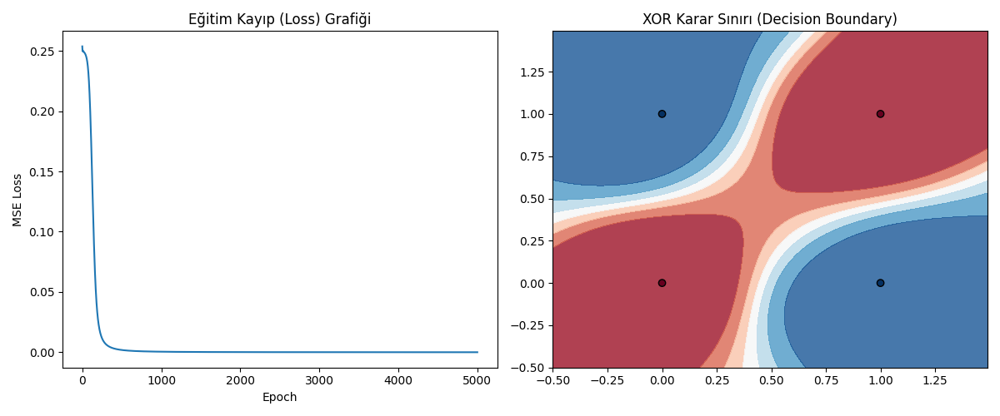

# 🧠 Çok Katmanlı Perceptron ile XOR Problemi Çözümü

Bu çalışma, yapay sinir ağlarının tarihsel gelişiminde kritik bir öneme sahip olan **XOR (Özel VEYA)** probleminin, derin öğrenme mimarileri kullanılarak nasıl çözüldüğünü uygulamalı olarak göstermektedir.

## 📝 Problem Tanımı
XOR problemi, verilerin tek bir düz çizgiyle (lineer) ayrılamadığı durumları temsil eder. Geleneksel Tek Katmanlı Perceptron modellerinin bu engeli aşamaması, derin öğrenmede "gizli katman" (hidden layer) ve "aktivasyon fonksiyonu" kavramlarının önemini ortaya çıkarmıştır.

## ⚙️ Kullanılan Teknolojiler
* 🐍 **Python 3.13**
* 🔥 **PyTorch** (Derin Öğrenme Kütüphanesi)
* 📊 **Matplotlib & Numpy** (Görselleştirme ve Veri İşleme)

## 🏗️ Model Mimarisi
Model, PyTorch kullanılarak **Çok Katmanlı Perceptron (MLP)** mimarisiyle inşa edilmiştir:
* **Giriş Katmanı:** 2 Nöron ($x_1, x_2$).
* **Gizli Katman:** 8 Nöron ve **Sigmoid** aktivasyon fonksiyonu (Doğrusal olmayan dönüşüm için).
* **Çıkış Katmanı:** 1 Nöron ve **Sigmoid** aktivasyon fonksiyonu.
* **Optimizasyon:** Adam Optimizer (lr=0.01) ve MSE Kayıp Fonksiyonu.

## 📈 Model Performansı
Model, 5000 epoch sonunda hata payını (loss) minimize ederek XOR mantığını kusursuz bir şekilde öğrenmiştir.

### Eğitim Kayıp ve Karar Sınırı Analizi
Aşağıdaki grafikte, hata oranının düşüşü ve modelin verileri ayırmak için oluşturduğu kavisli karar sınırı görülmektedir:



## 🚀 Çalıştırma
Projeyi yerel ortamınızda test etmek için:

1. Gerekli kütüphaneleri yükleyin:
```bash
pip install torch numpy matplotlib

2. Modeli çalıştırın:

python xor_model.py